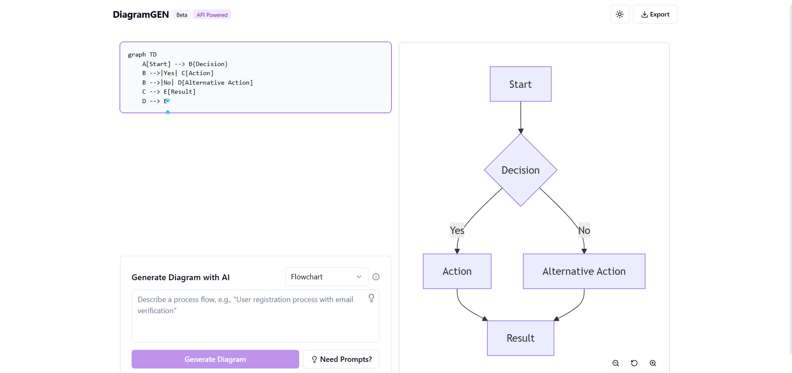

# AI Diagram Generator (DiagramGen)
A modern web application that generates professional diagrams using AI. Simply describe what you want, and get a beautiful Mermaid diagram instantly.


## Features
- **AI-Powered Diagram Generation**: Create diagrams from natural language descriptions- **Multiple Diagram Types**: Support for flowcharts, sequence diagrams, class diagrams, ER diagrams, Gantt charts, and more
- **Real-time Preview**: See your diagram update as you edit the code- **Export Options**: Save your diagrams for use in documentation and presentations
- **Responsive Design**: Works on desktop and mobile devices- **Dark/Light Mode**: Choose your preferred theme
## Diagram Types
- **Flowchart**: Visualize processes and workflows with connected nodes
- **Sequence Diagram**: Show interactions between participants in time sequence- **Class Diagram**: Represent class structure and relationships in OOP
- **Entity Relationship**: Model database entities and their relationships- **Gantt Chart**: Illustrate project schedules and task dependencies
- **Pie Chart**: Show proportional data in a circular graph- **State Diagram**: Represent states of a system and transitions between them
- **User Journey**: Map out user experiences and satisfaction levels
## Technology Stack
- **Frontend**: React, TypeScript, Tailwind CSS, shadcn/ui- **Diagram Rendering**: Mermaid.js
- **AI Integration**: Groq API (Claude model)
## Getting Started
### Prerequisites
- Node.js 16+- npm or yarn
### Installation
```bash
# Clone the repositorygit clone https://github.com/Raufjatoi/DiagramGen.git
cd diagram-generator
# Install dependenciesnpm install
# Start the development server
npm run dev```
### Environment Variables
Create a `.env` file in the root directory with the following:
```
VITE_GROQ_API_KEY=your_groq_api_key```
## Usage
1. Select a diagram type from the dropdown
2. Enter a description of the diagram you want to create3. Click "Generate Diagram" to create your diagram using AI
4. Edit the generated Mermaid code if needed5. Export your diagram when finished
## Contributing
Contributions are welcome! Please feel free to submit a Pull Request.

# Creator 
[Abdul Rauf Jatoi](https://raufjatoi.vercel.app)


# AI Diagram Generator (DiagramGen)
